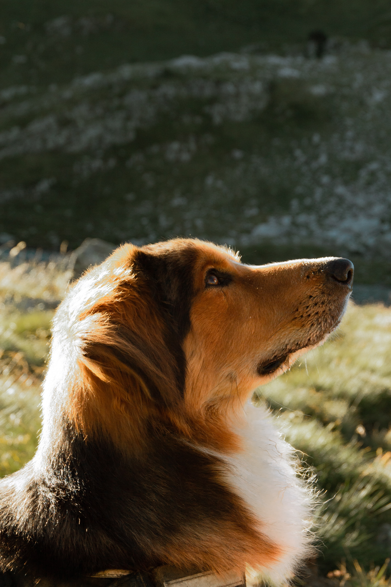

##Encabezados

# Encabezado de nivel 1
## Encabezado de nivel 2
### Encabezado de nivel 3
#### Encabezado de nivel 4
##### Encabezado de nivel 5
###### Encabezado de nivel 6

## Texto en Italica
*Ejemplo de texto en Italica*  
_otro ejemplo de texto en italica_

## Texto en negrita
**Ejemplo de texto en negrita**
__otro ejemplo de Texto en negrita__

**_otro ejemplo de Texto en negrita_**

***otro ejemplo de Texto en negrita***

***otro ejemplo de Texto en negrita***
*_otro ejemplo de Texto en negrita_*

>*"En un lugar de la mancha..."*

## Enlaces

[Enlace a la pagina del Instituto Meteorologico Nacional (IMN)](https://www.imn.ac.cr/web/imn/inicio)

##Imagenes

Imagen de perro

## Listas numeradas
1. Elemento 1
2. Elemento 2
3. Elemento 3

##Listas no numeradas
- Elemento A
- Elemento B
- Elemento C

- Elemento I
- Elemento II
- Elemento III

* Elementos 1
    * elemento a
    * elemento a
